# AF Deal Payment Tracker

## Overview
This is a modern, mobile-friendly web app for tracking and searching payment deals. It allows users to search by Email, Order ID, or WhatsApp Number, view results in a responsive table, export data, and customize visible columns.

## Features
- **Search by Email, Order ID, or WhatsApp Number**
- **Responsive UI**: Works on desktop and mobile
- **Show/Hide Columns**: Select which columns to display
- **Export to PDF/Excel**: Download results (real export using jsPDF and SheetJS)
- **Total Cashback Calculation**
- **Loading Animation** for searches
- **Dark/Light Theme Toggle**
- **Mobile Table Scrolling**
- **Column Sorting**
- **User Info Banner**: If your order is cancelled or has been updated incorrectly, please inform the admin to have it corrected.
- **Modern, accessible, and visually appealing design**

## How to Use
1. **Open the app in your browser.**
2. **Select a search type** (Email, Order ID, WhatsApp Number).
3. **Enter a value** and click **Search**.
4. **View results** in the table. Use the "Show/Hide Columns" button to customize columns.
5. **Export** results using the PDF/Excel buttons (real file download).
6. **Clear** to reset the search and UI.
7. **If your order is cancelled or updated incorrectly, inform the admin.**

## Technologies Used
- **HTML5, CSS3, JavaScript (Vanilla)**
- **jsPDF** and **jsPDF-AutoTable** (PDF export)
- **SheetJS (xlsx)** (Excel export)
- **Google Apps Script Web API** (for backend data)

## Customization
- **Add/Remove Columns**: Adjust the backend or JS to change columns.
- **Change Theme**: Edit CSS for new color schemes.
- **API Endpoint**: Update the fetch URL in `searchNow()` for your backend.

---

*This project is designed for easy deployment and customization for any payment tracking or order search workflow.* 
# Website Structure Diagram

```mermaid
graph TD
    %% Legend
    classDef nav fill:#e9d8fd,stroke:#764ba2,stroke-width:2px;
    classDef card fill:#f3e8ff,stroke:#764ba2,stroke-width:1.5px;
    classDef info fill:#fffbe6,stroke:#f6ad55,stroke-width:1.5px;
    classDef export fill:#e6fffa,stroke:#38b2ac,stroke-width:1.5px;
    classDef overlay fill:#f0f0f0,stroke:#a0aec0,stroke-width:1px;

    %% Landing Page
    subgraph Landing Page [index.html]
        L1["<i class='fas fa-rocket'></i> Logo & App Title"]
        L2["<i class='fas fa-bars'></i> Navigation Bar"]
        L3["<i class='fas fa-hourglass-half'></i> Card: Pending Order Lookup"]
        L4["<i class='fas fa-check-circle'></i> Card: Paid Payments"]
        L5["<i class='fas fa-info-circle'></i> Info Button (ℹ️)"]
        L6["<i class='fas fa-download'></i> Installable App Note"]
        L7["<i class='fas fa-bahai'></i> Animated Background & Loading Overlay"]
    end
    class L2 nav; class L3,L4 card; class L5 info; class L6 info; class L7 overlay;

    %% Pending Orders
    subgraph Pending Orders [pending.html]
        P1["<i class='fas fa-bars'></i> Navigation Bar"]
        P2["<i class='fas fa-search'></i> Header"]
        P3["<i class='fas fa-search'></i> Search Form"]
        P4["<i class='fas fa-info-circle'></i> Info Banner (Admin Notice)"]
        P5["<i class='fas fa-table'></i> Results Table"]
        P6["<i class='fas fa-columns'></i> Show/Hide Columns"]
        P7["<i class='fas fa-file-export'></i> Export PDF/Excel"]
        P8["<i class='fas fa-search-plus'></i> Search Within Results"]
        P9["<i class='fas fa-wifi'></i> Connection Status Banner"]
        P10["<i class='fas fa-spinner'></i> Loading Overlay"]
    end
    class P1 nav; class P4 info; class P6 card; class P7 export; class P9 info; class P10 overlay;

    %% Paid Payments
    subgraph Paid Payments [paid.html]
        D1["<i class='fas fa-bars'></i> Navigation Bar"]
        D2["<i class='fas fa-check'></i> Header"]
        D3["<i class='fas fa-search'></i> Search Form"]
        D4["<i class='fas fa-table'></i> Results Table"]
        D5["<i class='fas fa-columns'></i> Show/Hide Columns"]
        D6["<i class='fas fa-file-export'></i> Export PDF/Excel"]
        D7["<i class='fas fa-search-plus'></i> Search Within Results"]
        D8["<i class='fas fa-wifi'></i> Connection Status Banner"]
        D9["<i class='fas fa-spinner'></i> Loading Overlay"]
    end
    class D1 nav; class D8 info; class D5 card; class D6 export; class D9 overlay;

    %% Navigation Flows
    L3 -- "Card Click / NavBar" --> P1
    L4 -- "Card Click / NavBar" --> D1
    L2 -- "NavBar: Pending" --> P1
    L2 -- "NavBar: Paid" --> D1
    P1 -- "NavBar: Home" --> L2
    D1 -- "NavBar: Home" --> L2
    P1 -- "NavBar: Paid" --> D1
    D1 -- "NavBar: Pending" --> P1
    L5 -- "Opens Modal" --> L6

    %% Legend (as a subgraph for clarity)
    subgraph Legend [Legend]
        X1["<i class='fas fa-bars'></i> Navigation Bar"]
        X2["<i class='fas fa-info-circle'></i> Info/Notice"]
        X3["<i class='fas fa-file-export'></i> Export"]
        X4["<i class='fas fa-spinner'></i> Loading/Overlay"]
        X5["<i class='fas fa-columns'></i> Column Controls"]
        X6["<i class='fas fa-hourglass-half'></i> Pending Card"]
        X7["<i class='fas fa-check-circle'></i> Paid Card"]
    end
``` 

